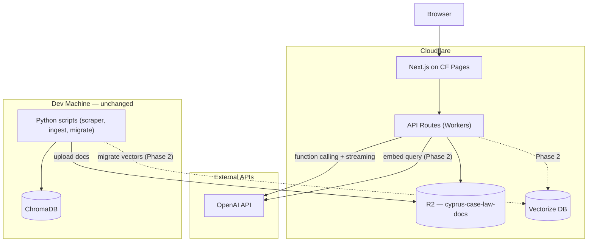

# Next.js Frontend Rewrite for Cloudflare

## Phased approach

Vectorization (both local model and OpenAI) is still running. Migrating vectors to Cloudflare Vectorize is blocked until that completes. **~150K parsed documents (5.5 GB) are ready** across all 15 courts and can be uploaded to R2.

> **Note (2026-02-07):** All 15 courts have been scraped and parsed (149,886 files total).
> The R2 upload script exists (`rag/upload_to_r2.py`) but has **not been run yet** — no files are in R2.

The plan is split into two phases:

| Phase | What | Blocked by | Can start |
|-------|------|------------|-----------|
| **Phase 1** | R2 upload + Next.js app (UI, doc viewer, auth) | Nothing | **Now** |
| **Phase 2** | Vectorize migration + retriever + chat search | Vectorization completing | Later |

Phase 1 delivers a deployable app with document viewer, auth, and the full chat UI — but the `search_cases` tool returns a "search unavailable" message until Phase 2 connects Vectorize.

---

## Architecture



---

## What changes vs what stays

| Component        | Before                             | After                                                |
| ---------------- | ---------------------------------- | ---------------------------------------------------- |
| Frontend UI      | `web/templates/chat.html` (Jinja2) | `frontend/app/` (Next.js + React)                    |
| API endpoints    | `web/app.py` (FastAPI Python)      | `frontend/app/api/` (Next.js API Routes, TypeScript) |
| Retriever        | `rag/retriever.py` (ChromaDB)      | `frontend/lib/retriever.ts` (Vectorize binding)      |
| LLM client       | `rag/llm_client.py`                | `frontend/lib/llm-client.ts`                         |
| Document storage | Local filesystem                   | Cloudflare R2 (`cyprus-case-law-docs` bucket)                  |
| Vector DB        | ChromaDB (local files)             | Cloudflare Vectorize (cloud)                         |
| Scraping tools   | `scraper/*.py`                     | **unchanged** (stays Python)                         |
| Ingestion tools  | `rag/ingest.py`, `rag/chunker.py`  | **unchanged** (stays Python)                         |
| Migration script | `rag/migrate_to_cloudflare.py`     | **unchanged** (stays Python)                         |

---

## New project structure

```
cylaw-study/
  frontend/                    # NEW: Next.js app
    app/
      layout.tsx               # Root layout with dark theme
      page.tsx                 # Chat page (main UI)
      login/page.tsx           # Password login page
      api/
        chat/route.ts          # POST: SSE streaming chat with function calling
        doc/route.ts           # GET: document viewer (reads from R2)
        auth/route.ts          # POST: password verification
    lib/
      retriever.ts             # Query Vectorize, return results (Phase 2)
      llm-client.ts            # OpenAI function calling + streaming
      types.ts                 # Shared TypeScript interfaces
    components/
      ChatArea.tsx             # Message thread component
      MessageBubble.tsx        # Single message (user or assistant)
      SourceCard.tsx           # Source citation card
      DocViewer.tsx            # Document viewer modal
      SearchIndicator.tsx      # "Searching..." animation
    wrangler.jsonc             # Cloudflare bindings (R2 now, Vectorize in Phase 2)
    next.config.ts             # Next.js config for Cloudflare
    package.json
    tsconfig.json
  rag/
    upload_to_r2.py            # NEW: upload parsed docs to R2
    migrate_to_cloudflare.py   # Existing: migrate vectors (Phase 2)
    ...                        # rest unchanged
  scraper/                     # UNCHANGED
  data/                        # UNCHANGED (local data)
```

---

## Phase 1: R2 + Frontend (start now)

### Step 1. Fix changelog rule

Update `.cursor/rules/changelog.mdc` to match existing `CHANGELOG.md` format:

```markdown
---
description: Update CHANGELOG.md when making user-facing changes
globs: "**/*.{ts,tsx,py}"
alwaysApply: false
---
# Changelog Maintenance
Format: use existing CHANGELOG.md structure with dated sections and ### Added/Changed/Fixed headers.
```

### Step 2. R2 document upload

Documents are ready in `data/cases_parsed/` (~150K `.md` files, ~5.5 GB across all 15 courts).

Upload script (`rag/upload_to_r2.py`) is written but **not yet run**.

**2a. Create R2 bucket:**

```bash
# Via Cloudflare API or wrangler
npx wrangler r2 bucket create cyprus-case-law-docs
```

**2b. Run upload:**

```bash
python -m rag.upload_to_r2
# Or test with: python -m rag.upload_to_r2 --limit 100
# Check progress: python -m rag.upload_to_r2 --stats
```

- Walks `data/cases_parsed/` recursively
- Uploads each `.md` file to R2 with key = relative path (e.g., `administrative/2016/201601-1113-13.md`)
- Uses Cloudflare S3-compatible API (boto3 with custom endpoint)
- Parallel uploads with progress tracking and resume support
- Expected: ~150K files, ~5.5 GB total

**Cost: ~$0/month** — 5.5 GB within R2 free tier (10 GB storage, 10M reads/mo, zero egress).

### Step 3. Initialize Next.js

```bash
cd frontend
npx create-next-app@latest . --typescript --tailwind --app --src-dir=false
npm install @opennextjs/cloudflare wrangler
npm install openai @anthropic-ai/sdk
npm install marked      # Markdown rendering
```

### Step 4. Configure wrangler (R2 only for now)

`frontend/wrangler.jsonc`:

```jsonc
{
  "name": "cylaw-chat",
  "compatibility_date": "2025-01-01",
  "compatibility_flags": ["nodejs_compat"],
  "r2_buckets": [
    {
      "binding": "DOCS_BUCKET",
      "bucket_name": "cyprus-case-law-docs"
    }
  ]
  // Vectorize binding will be added in Phase 2:
  // "vectorize": [{ "binding": "VECTORIZE", "index_name": "cylaw-cases" }]
}
```

### Step 5. Write TypeScript lib (Phase 1 scope)

**`lib/types.ts`** — shared interfaces:

```typescript
interface ChatMessage { role: "user" | "assistant" | "system"; content: string }
interface SearchResult { doc_id: string; title: string; court: string; year: string; text: string; score: number }
interface SSEEvent { type: "token" | "sources" | "searching" | "error" | "done"; data: unknown }
```

**`lib/llm-client.ts`** — function calling + streaming:

- Same logic as Python `rag/llm_client.py` but in TypeScript
- OpenAI SDK (`openai` npm), Claude via `@anthropic-ai/sdk`
- `search_cases` tool definition (identical schema to Python)
- Multi-step tool loop (max 5 rounds)
- SSE streaming for tokens, sources, searching events
- **Phase 1 behavior:** `search_cases` tool returns `{ results: [], message: "Search is being set up. Please try again later." }` — LLM can still answer general legal questions without search

### Step 6. Write API routes (Phase 1 scope)

**`app/api/doc/route.ts`** — document viewer (fully functional in Phase 1):

```typescript
export async function GET(request: Request, { env }) {
  const docId = new URL(request.url).searchParams.get("doc_id");
  const object = await env.DOCS_BUCKET.get(docId);
  if (!object) return Response.json({ error: "Not found" }, { status: 404 });
  const markdown = await object.text();
  return Response.json({ html: renderMarkdown(markdown) });
}
```

**`app/api/auth/route.ts`** — password verification (same as Python version).

**`app/api/chat/route.ts`** — chat with streaming:
- Functional in Phase 1 (LLM responds, function calling works)
- `search_cases` returns empty results with a message until Vectorize is connected
- LLM can still answer general legal knowledge questions

### Step 7. Write React components

- `ChatArea.tsx` — message thread
- `MessageBubble.tsx` — single message (user or assistant), renders Markdown
- `SourceCard.tsx` — source citation card (clickable → opens DocViewer)
- `DocViewer.tsx` — document viewer modal (fetches from `/api/doc`)
- `SearchIndicator.tsx` — "Searching..." animation

### Step 8. Write pages

- `app/page.tsx` — main chat page (Perplexity-style layout)
- `app/login/page.tsx` — password login page
- `app/layout.tsx` — root layout with dark theme

### Step 9. Deploy Phase 1

```bash
cd frontend
npx opennextjs-cloudflare build
npx opennextjs-cloudflare deploy
```

Set env vars in Cloudflare Pages dashboard: `OPENAI_API_KEY`, `ANTHROPIC_API_KEY`, `APP_PASSWORD`.

**Phase 1 delivers:**
- Working chat UI with LLM (general questions work, search returns "unavailable")
- Document viewer reading from R2 (fully functional)
- Password authentication
- Multi-model support (GPT-4o, Claude)

---

## Phase 2: Vectorize integration (when vectorization completes)

### Step 10. Migrate vectors to Cloudflare Vectorize

When OpenAI vectorization finishes:

```bash
# Create Vectorize index (if not created yet)
npx wrangler vectorize create cylaw-cases --dimensions 1536 --metric cosine

# Run existing migration script
python -m rag.migrate_to_cloudflare
```

Add Vectorize binding to `wrangler.jsonc`:

```jsonc
{
  "vectorize": [
    {
      "binding": "VECTORIZE",
      "index_name": "cylaw-cases"
    }
  ]
}
```

### Step 11. Write retriever and wire up chat

**`lib/retriever.ts`:**

- Embeds query via OpenAI API (`text-embedding-3-small`, 1536 dims)
- Queries `env.VECTORIZE.query(vector, { topK: 10, returnMetadata: "all" })`
- Supports metadata filtering by `court` and `year`
- Returns typed `SearchResult[]`

**Update `app/api/chat/route.ts`:**

- Replace stub `search_cases` with real Vectorize-backed retriever
- Remove "search unavailable" fallback

### Step 12. Test end-to-end and deploy final version

```bash
cd frontend
npx wrangler dev    # test with real Vectorize + R2 via remote bindings
```

Verify:
- Chat search returns relevant cases
- Document viewer shows full case text from R2
- SSE streaming works
- Multi-model switching works
- Auth works

Deploy final version:

```bash
npx opennextjs-cloudflare build
npx opennextjs-cloudflare deploy
```

---

## Implementation order (summary)

### Phase 1 — start now
1. Fix `changelog.mdc`
2. Create R2 bucket `cyprus-case-law-docs` + write and run upload script
3. Initialize Next.js in `frontend/`
4. Configure `wrangler.jsonc` (R2 binding only)
5. Write `lib/types.ts`, `lib/llm-client.ts`
6. Write API routes: `doc/route.ts` (R2), `auth/route.ts`, `chat/route.ts` (with stub search)
7. Write React components
8. Write pages (`page.tsx`, `login/page.tsx`)
9. Deploy Phase 1 to Cloudflare Pages

### Phase 2 — when vectorization completes
10. Migrate vectors: `python -m rag.migrate_to_cloudflare`
11. Write `lib/retriever.ts`, add Vectorize binding, wire up chat route
12. Test end-to-end with `wrangler dev`, deploy final version

---

## Local development

```bash
cd frontend
npm run dev          # standard Next.js dev (no Cloudflare bindings)
npx wrangler dev     # preview with Cloudflare bindings (R2 works in Phase 1, Vectorize in Phase 2)
```

## Environment variables (Cloudflare dashboard)

```
OPENAI_API_KEY=sk-proj-...
ANTHROPIC_API_KEY=sk-ant-...
APP_PASSWORD=cylaw2026
```

Set in Cloudflare Pages project settings, not in `.env`.
